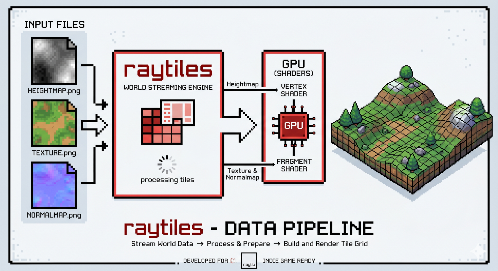

# Raytiles


**Raytiles** is a 3D geospatial engine 🌎 for [raylib](https://www.raylib.com/). Designed to stream and render the real
world in real time, it lets you visualize any location on Earth directly inside your raylib applications.

Built for indie developers and professionals alike, Raytiles is a perfect fit for UAV simulations, flight-planning
software,
lightweight GIS analysis, presentations, digital sand tables, and any other geospatial
visualization ([check out the examples below!](#raytiles-examples)).

It provides precise, ground-truth altitude data, essential for accurate collision detection and spawning mechanics in
games, as well as for topographical analysis in GIS workflows.

Originally developed to power a flight simulator, Raytiles was extracted into a lightweight, standalone library so it
can be embedded seamlessly into any raylib project.

🙋 Have a question or want to contribute⁉️ Use the [GitHub Discussions](https://github.com/ziv/raytiles/discussions) or
open an issue!


[](https://github.com/ziv/raytiles/actions/workflows/macos.yml)
[](https://github.com/ziv/raytiles/actions/workflows/linux.yml)
[](https://github.com/ziv/raytiles/actions/workflows/windows.yml)
[](https://github.com/ziv/raytiles/actions/workflows/emscripten.yml)

## Features

- Streaming **ANY** location on Earth!
- **Background** tile downloading (HTTP + persistent on-disk cache).
- Adaptive **LOD** (level-of-detail): more detail near the camera, less far away.
- **Lights and shadows** via normal maps.
- **GPU**-side displacement using a heightmap-driven vertex shader.
- Per-frame upload **budgeting** - no GPU stalls on bursty load.
- Ground-truth **altitude queries** (`ground_height`) for collision and spawning.
- **RAII** everywhere: zero manual `Unload*` calls, zero leaks on error paths.
- Pure **C++** and **C** wrapper APIs (`raytiles.h` and `craytiles.h`).
- **Cross-platform** builds for Windows, Linux, and macOS.
- **Configurable**: fit it to your needs by tweaking `raytiles::config` fields.
- **Open source** and permissively licensed (MIT).

## 3D Tiles

**Why not use 3D Tiles? (Cesium, Google Earth, etc.)**

3D Tiles is a powerful format for streaming and rendering large 3D geospatial datasets, but it comes with significant
complexity and overhead.

1. It is designed for walk-through resolution and visual fidelity, not for flight simulation, which is Raytiles' primary
   target.
2. Google 3D Tiles require an access token and offer only limited free usage, which can be a barrier for indie
   developers
   and small projects.
3. Google does not allow caching 3D Tiles data, so every time you want to render a location you have to re-fetch from
   Google's servers, leading to latency and increased bandwidth usage.
4. The 3D Tiles glTF format stores coordinates in double precision, which does not fit raylib's float-based rendering
   pipeline. The data must be decoded on the CPU and re-uploaded to the GPU every frame, hurting performance.
5. Cesium 3D Tiles is even more complex: unlike Google, it does not provide ready-made models, only mesh data. The rest
   of the pipeline is essentially what Raytiles already does.

This project actually started out using 3D Tiles, and a 3D Tiles renderer implementation lives in the `legacy/`
directory,
but it was eventually dropped in favor of a simpler, lightweight approach better suited to Raytiles' needs.

Example of the 3D Tiles renderer in action using Google 3D Tiles (with debug data and grid):


## Raytiles Examples

### Rendering Area of Interest

The following example video shows part of the Greek islands, rendered with Mapbox tiles at zoom levels 11 to 14:

https://github.com/user-attachments/assets/0422ffea-654f-4299-8860-23f99d7d98ec

### Lights and Shadows (Sun effect)

This example demonstrates lights and shadows:

https://github.com/user-attachments/assets/6e373cb4-a1fa-4c21-a72a-db2d0bd96a89

## Quick Start

If you are using CMake, you can add **raytiles** using `FetchContent`:

```cmake
include(FetchContent)
FetchContent_Declare(
        raytiles
        GIT_REPOSITORY https://github.com/ziv/raytiles.git
        GIT_TAG v0.7.0
        GIT_SHALLOW TRUE
)
FetchContent_MakeAvailable(raytiles)
```

The following example shows how to use the C++ API to stream and render the world in a raylib application:

```cpp
#include "raylib.h"
#include "raytiles.h"

int main() {
  InitWindow(1280, 720, "raytiles");

  // streamer configuration with default values; tweak as needed
  raytiles::world_config world;
  raytiles::streaming_config streaming;
  raytiles::rendering_config rendering;

  // pool configuration with default values; tweak as needed
  raytiles::pool_config pool_conf;

  // streamer instance
  raytiles::streamer streamer(world, streaming, rendering, pool_conf);

  Camera3D camera = /* ... your camera ... */;

  while (!WindowShouldClose()) {
    // update the streamer with the current camera state
    streamer.update(camera);

    BeginDrawing();
        ClearBackground(SKYBLUE);
        BeginMode3D(camera);
            // draw the streamed world
            streamer.draw(camera);
        EndMode3D();
    EndDrawing();
  }

  CloseWindow();
}
```

See `sandbox/main.cpp` for a full runnable example with input handling.

## Anchors

**Raytiles** uses an anchor-based system to decide which part of the world to stream and render. An anchor is a point
in the world that serves as the reference for streaming and rendering. This point becomes your raylib world origin
(`X=0, Y=0, Z=0`).

To define an anchor, find the tile coordinates (x, y, zoom) for the location you want to stream.

You can use the following tools to find the tile coordinates for a specific location:

- https://labs.mapbox.com/what-the-tile/
- https://tools.geofabrik.de/calc/#type=geofabrik_standard&grid=1

Find the tile at zoom 9 closest to your area of interest and put those values in the configuration:

```c++
raytiles::config conf;

conf.anchor_x_tile = 123;
conf.anchor_z_tile = 456;
```

## Providers

**raytiles** is designed to be provider-agnostic, allowing you to use any tile server that follows the XYZ tiling
scheme (slippy-map format).

It ships with built-in provider, **Esri** for textures and **Mapzen** for heightmaps (Terrarium format) and
normals, but you can plug in any other provider via the `raytiles::pool_config` struct.

#### Heightmap and Normals Provider

It is not recommended to replace the elevation provider, since the height-calculation strategy is tightly coupled to the
encoding of the heightmap. The texture provider, on the other hand, can be replaced freely.

Mapzen's height-encoding reference [can be found here](https://github.com/tilezen/joerd/blob/master/docs/formats.md).

#### Texture Provider

The default texture provider is configured as follows:

```c++
raytiles::pool_config pool_conf;

pool_conf.texture_url = "https://server.arcgisonline.com/ArcGIS/rest/services/World_Imagery/MapServer/tile/{zoom}/{y}/{x}";
```

Example of using **Mapbox** as texture provider (requires an access token):

```c++
raytiles::pool_config pool_conf;

pool_conf.texture_url = "https://api.mapbox.com/v4/mapbox.satellite/{zoom}/{x}/{y}.pngraw?access_token=YOUR_MAPBOX_ACCESS_TOKEN";
```

## Caching

**raytiles** includes a simple on-disk caching mechanism that stores downloaded tiles, reducing bandwidth usage and
improving performance on subsequent runs. The cache is organized by provider and tile coordinates, making it easy to
manage or clear when needed. The cache directory and behavior are configured through the `raytiles::pool_config`
struct.

The cache currently has no eviction policy, so it grows indefinitely as more tiles are downloaded. You can clear it
manually by deleting the cache directory.

For caching purposes, the downloader pool does not cancel in-flight requests, so even if a tile is no longer needed it
will still be downloaded and cached. There is
[an open issue to add support for request cancellation](https://github.com/ziv/raytiles/issues/48).

## Memory Usage

The default configuration is tuned for relatively low memory usage, with at most ~600 tiles resident at any given
time. Any change in configuration may affect memory usage, so it's worth understanding how the numbers break down.

- Tile size: $256 \times 256=65,536$ pixels
- RGBA texture: $65,536 \text{ pixels} \times 4 \text{ channels} = 262,144$ bytes (256 KB) per tile (uncompressed)

VRAM:

- Albedo texture + mipmap: $256 \text{ KB} \times 1.33 = \textbf{341 KB}$
- Heightmap texture $\textbf{256 KB}$
- Normal map texture $\textbf{256 KB}$
- VRAM per tile (uncompressed with mipmap): $341 + 256 + 256 = \textbf{853 KB}$

We also hold a copy of the heightmap in RAM for fast altitude queries, which adds 256 KB per tile. For 600 tiles, the
total memory usage would be approximately:

- VRAM $853 \text{ KB} \times 600 = 511,800 \text{ KB} \approx \textbf{500 MB}$
- RAM $256 \text{ KB} \times 600 = 153,600 \text{ KB} = \textbf{150 MB}$

## How It Works

Raytiles is a conductor that orchestrates file reads and downloads, GPU uploads, and rendering. The rest of the magic
happens in the shaders, where GPU-side displacement and normal mapping create the illusion of detailed terrain without
the overhead of complex geometry.



---

## TODOs

- [x] support normals for lighting (in progress)
- [ ] support more than level 15 zoom
- [ ] add sky module (atmosphere + sun + moon + stars)

---


Made with ❤️ for the raylib community. If you find this library useful, please consider starring the repo and sharing
it with your friends! Contributions and feedback are always welcome. Happy coding!
