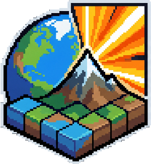
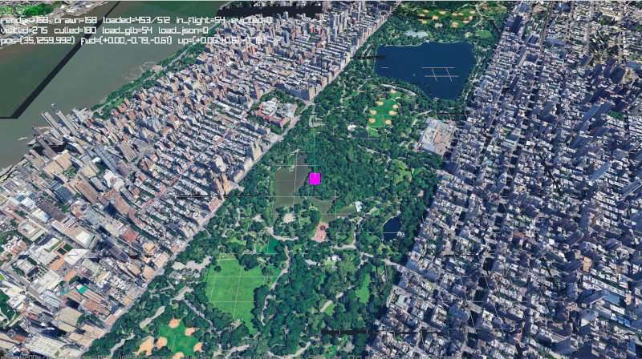

# Raytiles

    
     
    3D eospatial engine for raylib

**Raytiles**, a 3D geospatial engine 🌎 for [raylib](https://www.raylib.com/), designed to stream and render the real
world in real time. It lets you visualize any location on Earth directly inside your raylib applications.

Built for indie developers and professionals alike, Raytiles is a perfect fit for UAV simulations, flight-planning
software,
lightweight GIS analysis, presentations, digital sand tables, and any other geospatial
visualization ([check out the examples below!](#raytiles-examples)).

It provides precise, ground-truth altitude data, essential for accurate collision detection and spawning mechanics in
games, as well as for topographical analysis in GIS workflows.

Originally developed to power a flight simulator, Raytiles was extracted into a lightweight, standalone library so it
can be embedded seamlessly into any raylib project.

🙋 Have a question or want to contribute⁉️ Use the [GitHub Discussions](https://github.com/ziv/raytiles/discussions) or
open an issue!

## Features

- Streaming and rendering **ANY** location on Earth!
- Adaptive **LOD** (level-of-detail)
- **Lights and Shadows** via normal maps
- Ground-truth **altitude/height queries** for collision and spawning
- Configurable & **providers agnostic**
- **C++** API & **C** wrapper API
- Background tile downloading (HTTP + persistent on-disk cache)
- **Cross-platform** builds for Windows, Linux, and macOS
- **Open source** and permissively licensed (MIT)

## Content

- [Quick Start](https://github.com/ziv/raytiles/wiki/Quick-Start)
- [Anchors](https://github.com/ziv/raytiles/wiki/Anchors)
- [Providers](https://github.com/ziv/raytiles/wiki/Providers)
    - [Working with MapBox](https://github.com/ziv/raytiles/wiki/Working-with-Mapbox)
- [Handling Tiles Gaps](https://github.com/ziv/raytiles/wiki/Handling-Tiles-Gaps)
- [Caching](https://github.com/ziv/raytiles/wiki/Caching)
- [Memory Usage](https://github.com/ziv/raytiles/wiki/Memory-Usage)
- [Configuration](https://github.com/ziv/raytiles/wiki/Configuration)

## Demo & Usage

See [`sandbox/demo.cpp`](./sandbox/demo.cpp) for a full runnable example with input handling.

## Raytiles Examples

### Rendering Area of Interest

The following example video shows part of the Greek islands, rendered with Mapbox tiles at zoom levels 11 to 14:

https://github.com/user-attachments/assets/0422ffea-654f-4299-8860-23f99d7d98ec

### Lights and Shadows (Sun effect)

This example demonstrates lights and shadows:

https://github.com/user-attachments/assets/6e373cb4-a1fa-4c21-a72a-db2d0bd96a89

## 3D Tiles

**Why not use 3D Tiles? (Cesium, Google Earth, etc.)**

3D Tiles is a powerful format for streaming and rendering large 3D geospatial datasets, but it comes with significant
complexity and overhead.

1. It is designed for walk-through resolution and visual fidelity, not for flight simulation, which is Raytiles' primary
   target.
2. Google 3D Tiles require an access token and offer only limited free usage, which can be a barrier for indie
   developers
   and small projects.
3. Google does not allow caching 3D Tiles data, so every time you want to render a location you have to re-fetch from
   Google's servers, leading to latency and increased bandwidth usage.
4. The 3D Tiles glTF format stores coordinates in double precision, which does not fit raylib's float-based rendering
   pipeline. The data must be decoded on the CPU and re-uploaded to the GPU every frame, hurting performance.
5. Cesium 3D Tiles is even more complex: unlike Google, it does not provide ready-made models, only mesh data. The rest
   of the pipeline is essentially what Raytiles already does.

This project actually started out using 3D Tiles, and a 3D Tiles renderer implementation lives in the `legacy/`
directory,
but it was eventually dropped in favor of a simpler, lightweight approach better suited to Raytiles' needs.

Example of the 3D Tiles renderer in action using Google 3D Tiles (with debug data and grid):

---

Made with ❤️ for the raylib community. If you find this library useful, please consider starring the repo and sharing
it with your friends! Contributions and feedback are always welcome. Happy coding!
