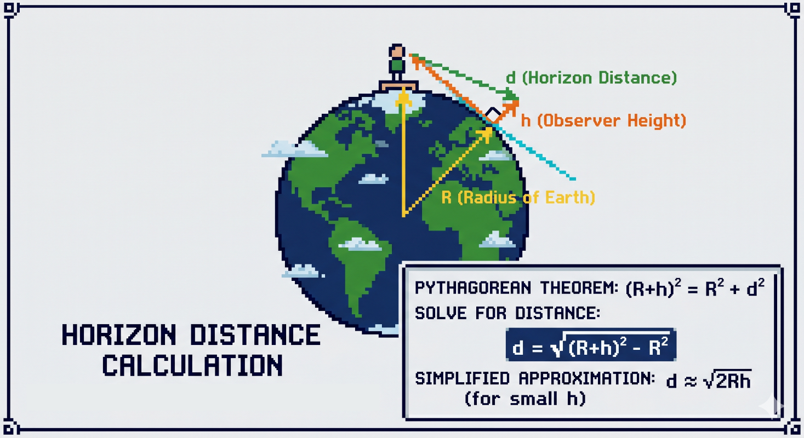

# Raytiles

Drafts and number crunching for the raytiles implementation.

By Ziv Perry, 2026-05-01

## Tile Sizes Calculation

$TileWidth_{meters} = \frac{C \cdot \cos(\phi)}{2^z}$

where:

- C is the circumference of the Earth (approximately 40,075 km)
- φ is the latitude
- z is the zoom level

For our fixed size tiles of 256x256 pixels, we can calculate the tile width in meters at different zoom levels (z) and
latitudes (φ):

$Resolution = \frac{C \cdot \cos(\phi)}{256 \cdot 2^z}$

### Example Calculations

- Equator $\phi=0$
- TLV $\phi=\cos(32^\circ)$

| Zoom Level (z) | Latitude (φ) | Resolution (meters/pixel) | Tile Width (meters) |
|----------------|--------------|---------------------------|---------------------|
| 15             | Equator      | 4.77                      | 1222                |
| 15             | TLV          | 4.05                      | 1036                |
| 14             | Equator      | 9.54                      | 2445                |
| 14             | TLV          | 8.10                      | 2072                |
| 13             | Equator      | 19.11                     | 4890                |
| 13             | TLV          | 16.20                     | 4144                |
| 12             | Equator      | 38.22                     | 9780                |
| 12             | TLV          | 32.40                     | 8288                |
| 11             | Equator      | 76.44                     | 19560               |
| 11             | TLV          | 64.80                     | 16576               |
| 10             | Equator      | 152.88                    | 39120               |
| 10             | TLV          | 129.60                    | 33152               |
| 9              | Equator      | 305.77                    | 78240               |
| 9              | TLV          | 259.20                    | 66304               |

From now on, all calculations will be based on $\phi=32^\circ$ but the real values are configurable in the code.

## Distances

From commercial aircraft, at 43K feets (~13Km) the distance to the horizon is approximately 250 miles (~400km).

From Pythagorean theorem, we can calculate the distance to the horizon `d` based on the height of the observer `h` and
the radius of the Earth `R` (let say Earth is a perfect sphere):

$$(R + h)^2 = R^2 + d^2$$

Where:

- R is the radius of the Earth (approximately 6371 km)
- h is the height of the observer
- d is the distance to the horizon

$$d = \sqrt{2Rh + h^2}$$

For $(R ≫ h)$, we can simplify the formula to:

$$d \approx \sqrt{2Rh}$$

$$d \approx {3.57}\cdot10^3\sqrt{h}$$

**We limit the GPU pixels rendeing by limit the far plane to the horizon distance.**

### About Tiles Loading

We are always load the surrounding tiles. We render only those we can actually see, but we have to load the entire
raduis around us to support aircraft manouvers that can change the camera position and orientation quickly.

## Tile Zoom Level Selection

The following table shows the distance thresholds for each zoom level, it can be changed in the configuration.

| Zoom Level (z) | Distance Threshold (m) | 
|----------------|------------------------|
| 9              | -                      | 
| 10             | -                      | 
| 11             | 55000                  | 
| 12             | 25000                  |                                   
| 13             | 10000                  |                    
| 14             | 5000                   |                                   
| 15             | 1000                   |                                      

In zoom level 11, radius of ~10 (350km width total) is our base zoom level. You can increase the radius to cover more
area, but it will increase the number of tiles we need to load and render.

## Tiles Selection

Iterating from -10 to +10 in both X and Z directions, we will cover an area of 21x21 tiles around the camera position at
zoom level 11, which is sufficient to cover half of the horizon distance of 400km.

$$(2*R+1)*TileWidth_{meters} \approx 21*16.5km = 346.5km$$

While the iteration is based on the lowest zoom level, the actual rendering distance is based on the camera height and
the distance to the tile.

For each tile in base zoom level, calculate the distance to the camera (XYZ distance). Check in the thresholds to
decide if we need to display it or not, and if we display it, if we need to subdivide it into higher zoom level.

Update the `desired_keys` with the tiles that should be rendered based on the camera position and zoom level.

For any tile in `desired_keys` not spawned yet, spawn it.

### Performance optimizations:

During the creation of the desired keys list, add a check if the tile is frustum culling and mark it as so.
Sort the list by frustum culling and spawn first those who are in the frustum, and then those who are not.
This way we can start rendering the visible tiles faster while the others are still loading.

## Tile Subdivision Decision

Each zoom level has a distance threshold. If the distance from the camera to the tile is less than the threshold, we
subdivide the tile into 4 sub-tiles of the next zoom level and repeat the process for each sub-tile. If the distance is
greater than the threshold, we render the tile as is.

## Tile Eviction

Each tile that not in the desired keys list is a candidate for eviction.
We can evict a tile only if it has a replacement or if it is not is the right distance for its zoom level.

## Tiles Usage

The tiles will follow the raylib application XYZ coordinates, where X is the east-west axis, Y is the up-down axis, and
Z is the north-south axis.

- Currently max zoom level is 15 (provider dependent).
- There is no limit of the min zoom level, but we will set it to 9 since zoom 8 covers an area larger than the horizon
  distance.

### Positioning

To work with float numbers required by the vectors of raylib, we have to use an anchore point for the tiles, and
calculate the offset of each tile from the anchor point.

If we want to travel to far that floats are not enough to represent the position of the tiles, we can change the anchor
point to be closer to the camera position, and calculate the offset.

### Sizing

To avoid calculate the tiles sizes, we will hold a pre-calculated size for each zoom level for a given latitude.

## Implementation Details

### Preparations

On construction, we will create for each supported zoom level:

1. Tile size in meters.
2. Min and max distance for rendering this zoom level.
3. Resolution in number of vertices per tile.
4. Mesh from the tile size and resolution.