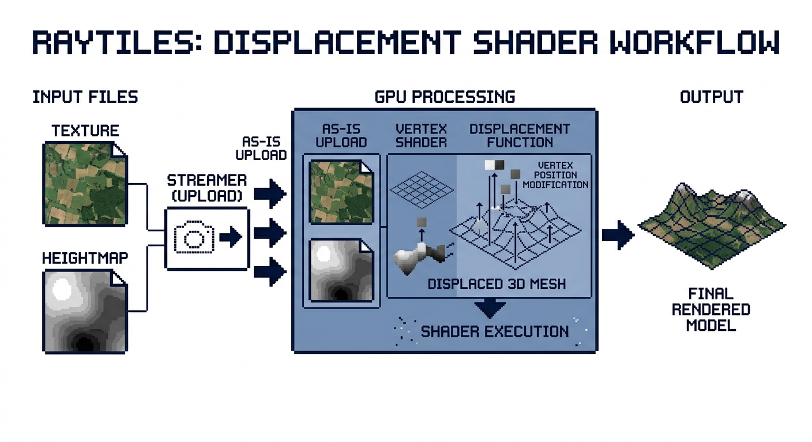

# Raytiles


3D world streaming engine for [raylib](https://www.raylib.com/). Get a bird's-eye view of the world around you, rendered
in real-time from satellite imagery and elevation data.

Originally developed for a flight simulator project, and extracted into a standalone library to allow embedding in any
raylib application.

Built for small-scale flight simulators, mission planners, and any other geospatial visualizations. Allow streaming any
location on Earth at zoom level up to 15.

[](https://github.com/ziv/raytiles/actions/workflows/macos.yml)
[](https://github.com/ziv/raytiles/actions/workflows/linux.yml)

The following example video is part of the islands of Greece, rendered with Mapbox tiles at zoom level 11 to 14:

https://github.com/user-attachments/assets/0422ffea-654f-4299-8860-23f99d7d98ec

## Features

- Streaming **ANY** location on Earth!
- **Background** tile downloading (HTTP + persistent on-disk cache).
- Adaptive **LOD** (level-of-detail): more detail near the camera, less far away.
- **GPU**-side displacement via a heightmap-driven vertex shader.
- Per-frame upload **budgeting**, no GPU stalls on bursty load.
- Ground-truth **altitude queries** (`ground_height`) for collision / spawning.
- **RAII** everywhere: zero manual `Unload*` calls, zero leaks on error paths.
- Pure **C++** and **C** wrapper APIs (`raytiles.h` and `craytiles.h`).
- **Configurable**! fit it to your needs by tweaking `raytiles::config` fields.
- **Open-source** and permissively licensed (MIT)



## Quick Start

`MAPBOX_TOKEN` environment variable must be set to a valid Mapbox API token before running the example below.

```cpp
#include "raytiles.h"

int main() {
  InitWindow(1280, 720, "raytiles");

  raytiles::config conf;
  conf.rendering_radius = 7;
  conf.max_zoom = 14;

  raytiles::provider provider(std::getenv("MAPBOX_TOKEN"));
  raytiles::streamer streamer(conf, provider);

  Camera3D camera = /* ... your camera ... */;

  while (!WindowShouldClose()) {
    streamer.update(camera);

    BeginDrawing();
    ClearBackground(SKYBLUE);
    BeginMode3D(camera);
    streamer.draw(camera);
    EndMode3D();
    EndDrawing();
  }

  CloseWindow();
}
```

See `sandbox/main.cpp` for a full runnable example with input handling.

## TODOs

- [x] support raylib 6.0
- [ ] add clear method to flush the cache and reset the streamer
- [ ] support windows builds (MSVC + MinGW)
- [x] support Linux builds (GCC + Clang)
- [ ] support web builds (emscripten)
- [x] support more providers (TomTom, OpenStreetMap, etc.)
- [ ] support more than level 15 zoom
- [ ] add sky module (atmosphere + sun + moon + stars)